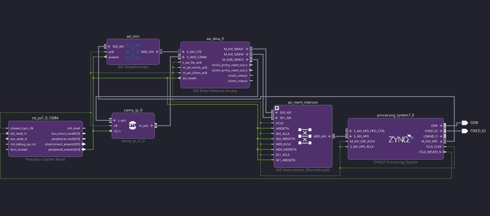
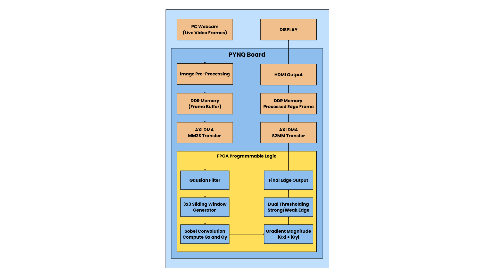
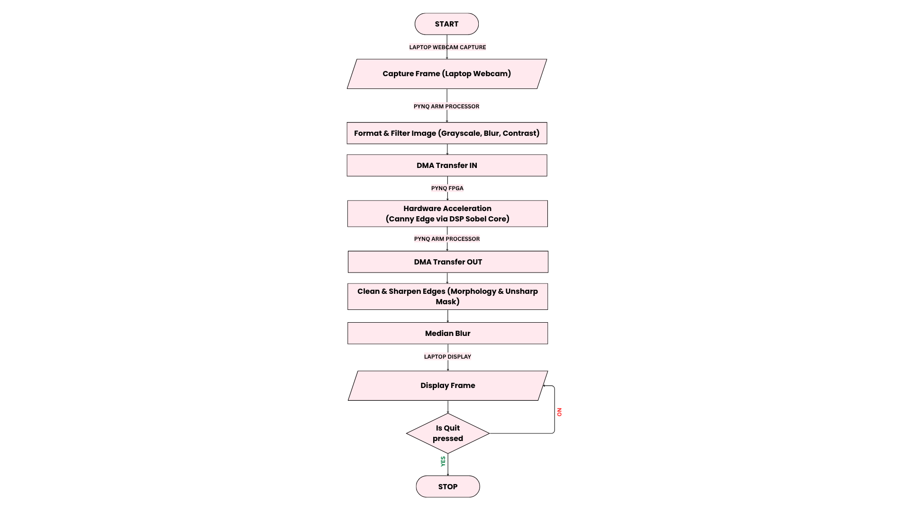
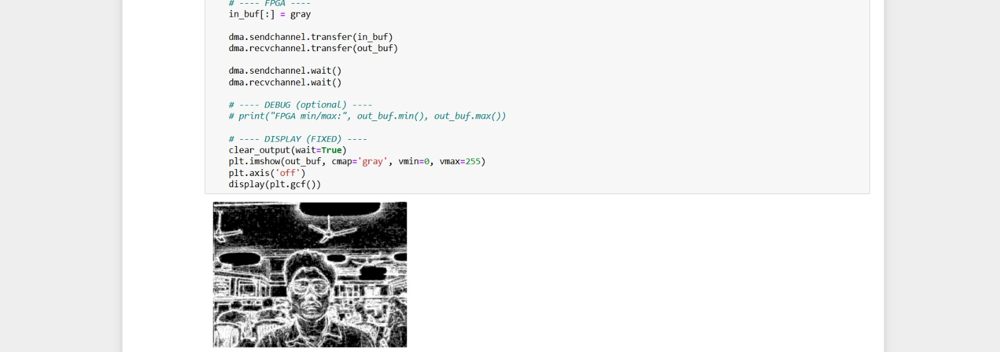

# SKILL LAB PRATICAL HACKATHON

## Final Project README

> **Project Weight:** 100%  
> **Team Size:** 4/3 students  
> **Project Duration:** 16 hours  
> **Total Time Available:** 32 effort-hours per team  
> **Project Type:** Playful, interactive, technology-based experience

---

# Before you begin

## Fork and rename this repository

After forking this repository, rename it using the format:

`SKILLLAB_PROR-2026-TeamName`

### Example

`SKILLLAB_PROR-2026-AuroWizards`

Do not keep the default repository name.

---

# How to use this README

This file is your team’s **working project document**.

You must keep updating it throughout the build period.  
By the final review, this README should clearly show:

- your idea,
- your planning,
- your design decisions,
- your technical process,
- your build progress,
- your testing,
- your failures and changes,
- your final outcome.

## Rules

- Fill every section.
- Do not delete headings.
- If something does not apply, write `Not applicable` and explain why.
- Add images, screenshots, sketches, links, and videos wherever useful.
- Update task status and weekly logs regularly.
- Use this file as evidence of process, not only as a final report.

---

# 1. Team Identity

## 1.1 Group Name

`Sabbath`

## 1.2 Team Members

| Name                  | Primary Role                    | Secondary Role   | Strengths Brought to the Project |
| --------------        | ------------------------------- | --------------   | -------------------------------- |
| `Shlok Shety` | `[Electronics / Coding / App ]` | `Documentation`  | `Documentation, Gift of Gab `|
| `Rahul Vidwans`        | `[Electronics / Fabrication]`   | `[Coding]`       | `Material Handling, Hardware`    |
| `Samruddhi Shimpi`        | `[Electronics / Fabrication]`   | `[Coding]`       | `Material Handling, Hardware`    |
| `Atharva Chaudhari`        | `[Electronics / Fabrication]`   | `[Coding]`       | `Material Handling, Hardware`    |

## 1.3 Project Title

`Realtime edge detection using FPGA`

## 1.4 One-Line Pitch

`A real-time FPGA-accelerated Canny edge detection system using the PYNQ-Z2 board that processes live camera input and generates high-speed edge-enhanced output using DSP-based image processing.`

## 1.5 Expanded Project Idea

**Response:**  

`This project focuses on developing a real-time edge detection system using the PYNQ-Z2 FPGA platform to demonstrate high-speed hardware-accelerated image processing. The system captures live video input from a webcam and preprocesses the frames using Python and OpenCV inside a Jupyter Notebook environment. The grayscale image is then transferred to a custom FPGA IP core through AXI DMA, where edge detection is performed in real time using Sobel-based gradient computation and DSP48-accelerated convolution.`

`Unlike traditional CPU-based image processing, where pixels are processed sequentially, the FPGA processes multiple operations simultaneously using pipelining, streaming architectures, and dedicated DSP hardware blocks. The system uses line buffers, sliding convolution windows, Gaussian filtering, gradient magnitude approximation, and dual-threshold edge extraction to generate a continuous real-time edge-enhanced video output with very low latency.`

`By combining FPGA hardware acceleration with computer vision techniques, the project demonstrates how hardware/software co-design can improve image processing performance for real-time video processing, embedded systems, smart cameras, and basic computer vision applications.`

---

# 2. Inspiration

## 2.1 References

List what inspired the project.

| Source Type | Title / Link                                                        | What Inspired You                                                                         |
| ----------- | ------------------------------------------------------------------- | ----------------------------------------------------------------------------------------- |
| `[Video]`   | `https://youtu.be/Ut5s4rImEhI?si=zgon5YOzGiYfu-Zj` | `How the company is using it's tech to perform image scans` |
|             |                                                                     |                                                                                           |
|             |                                                                     |                                                                                           |

## 2.2 Original Twist

**Response:**

`This project combines a Canny-inspired edge detection pipeline with Canny-based gradient computation implemented entirely on FPGA using pure Verilog RTL and DSP48 hardware acceleration on the PYNQ-Z2 platform. The system uses AXI DMA, streaming architectures, pipelined processing, and dedicated DSP hardware blocks to achieve low-latency real-time edge detection from live webcam input, creating an optimized FPGA-based image processing pipeline without relying on high-level synthesis tools.`

---

# 3. Project Intent

## 3.1 User Journey

**Response:**

`The user starts the system using a Jupyter Notebook running on the PYNQ-Z2 board and connects a webcam for live video input. The webcam continuously captures video frames, and Python with OpenCV converts them into grayscale images before sending them to the FPGA through AXI DMA. Inside the FPGA, the custom Verilog edge detection IP processes the frames using Canny-inspired edge detection and DSP48-accelerated computation. The user can then observe the real-time edge-detected video output displayed live on the screen, where object boundaries and edges are highlighted continuously.`

---

# 4. Definition of Success

## 4.1 Definition of “Usable”

`In this project, the system is considered usable when the live image feed is captured and processed continuously without interruption, the FPGA correctly performs edge detection on incoming frames, and the output displays clear and stable edges in real time. Additionally, the data transfer through AXI DMA must operate reliably without crashes or delays, ensuring smooth and consistent overall performance.`

---

## 4.2 Minimum Usable Version

**Response:**

`The smallest version of this project that still delivers the core experience consists of a basic real-time pipeline where a laptop webcam captures live video, the image is converted to grayscale using Python and OpenCV, and the frames are transferred to the FPGA through AXI DMA. The FPGA then performs Canny-inspired edge detection using the custom Verilog RTL IP and returns the processed output, which is displayed on the screen in real time.`

---

## 4.3 Stretch Features

`- Complete hardware-based Canny edge detection implementation`

`- Improved Gaussian blur and noise reduction techniques`

`- Thinner edge generation using non-maximum suppression`

`- Adjustable threshold control for edge sensitivity`

`- Support for multiple edge detection filters`

`- Higher-resolution image processing`

`- Hardware-based grayscale conversion`

`- User interface for selecting modes and tuning parameters`

---

# 5. System Overview

## 5.1 Project Type

Check all that apply.

- [x] Electronics-based

- [ ] Mechanical

- [ ] Sensor-based

- [x] App-connected

- [ ] Motorized

- [ ] Sound-based

- [x] Light-based

- [ ] Screen/UI-based

- [ ] Fabricated structure

- [ ] Game logic based

- [ ] Installation

- [ ] Other:

## 5.2 High-Level System Description

Explain how the system works in simple terms.

Include:

- input,
- processing,
- output,
- physical structure,
- app interaction if any.

**Response:**  

`The system takes live video input from a webcam connected to a laptop or PC. Python and OpenCV running inside Jupyter Notebook preprocess the incoming video frames by converting them into grayscale images and transferring them to the PYNQ-Z2 FPGA through AXI DMA.`

`Inside the FPGA, a custom Verilog edge detection module performs Gaussian filtering, Canny-based edge detection using Sobel-based gradient computation, and threshold-based processing using DSP48 hardware acceleration. The processed edge-detected frames are then sent back and displayed live on the screen in real time.`

`The physical setup includes a webcam, the PYNQ-Z2 FPGA board, a laptop or PC running the Jupyter environment, and a monitor for displaying the output. Jupyter Notebook acts as the main interface for controlling the FPGA overlay and managing the real-time image processing pipeline.`

## 5.3 Input / Output Map

| System Part | Type | What It Does |
| ------------------------- | --------:| ------------------------------------- |
| `Laptop Webcam` | `Input` | `Captures live video frames` |
| `Python/OpenCV` | `Processing` | `Converts frames into grayscale and preprocesses the image` |
| `AXI DMA` | `Data Transfer` | `Transfers image frames between the processor and FPGA` |
| `FPGA Edge Detection IP` | `Processing` | `Performs edge detection operations` |
| `DSP48 Blocks` | `Hardware Acceleration` | `Accelerates convolution and arithmetic operations` |
| `Jupyter Notebook` | `Control Interface` | `Controls the FPGA overlay and processing pipeline` |
| `Laptop Display` | `Output` | `Displays the real-time edge-detected video output` |

# 6. System Design, Sketches and Visual Planning 

## 6.1 Concept Architecture/sketch/schematic

Add an early sketch of the full idea.

## System Block Design 

## 6.2 Labeled Build Sketch/architecture/flow diagram/algorithm

Add a sketch with labels showing:

- structure,
- electronics placement,
- user touch points,
- moving parts,
- output elements.

## FPGA Edge Detection Architecture

## 6.3 Approximate Dimensions

NA

---

# 7. Electronics Planning

## 7.1 Electronics Used

| Component                 | Quantity | Purpose                               |
| ------------------------- | --------:| ------------------------------------- |
| `PYNQ-Z2 FPGA Board `       | `1`      | `[Main controller]`                   |
| `Laptop `    | `1`      | `Handles webcam input and displays the processed output`|

## 7.2 Wiring Plan

Describe the main electrical connections.

NA

## 7.3 Circuit Diagram/architecture diagram

Insert a hand-drawn or software-made circuit diagram.

**Insert image below:**  
`[Upload image and link here]`

# 7.4. Power Plan

| Question | Response |
|---|---|
| Voltage required | `5V DC for the PYNQ-Z2 board` |                                                        

---

# 8. Software Planning

## 8.1 Software Tools

| Tool / Platform                | Purpose                                        |
| ------------------------------ | ---------------------------------------------- |
| `Vivado`                | `used to design, implement, and generate the FPGA hardware (edge detection IP and system architecture).`                                |
| `Jupyter notebook`       | `used to control the system, capture and preprocess images, and communicate with the FPGA using DMA.` |

## 8.2 Software Logic/Algorithm

Describe what the code must do.

Include:

- startup behavior,
- input handling,
- sensor reading,
- decision logic,
- output behavior,
- communication logic,
- reset behavior.
  
**Response:**

`- Startup behavior:
The system initializes the webcam, AXI DMA engine, FPGA overlay, and Jupyter Notebook environment.`

`- Input handling:
Live video frames are continuously captured from the PC webcam using Python and OpenCV.`

`- Sensor reading:
The webcam continuously provides RGB image frames for real-time processing.`

`- Decision logic:
Python preprocesses the incoming frames using grayscale conversion, Gaussian blur, and image enhancement before transferring them to the FPGA through AXI DMA. The FPGA performs Sobel-based edge detection and threshold-based processing.`

`- Output behavior:
The FPGA returns the processed edge-detected output, which is postprocessed and displayed live on the screen.`

`- Communication logic:
AXI DMA is used for high-speed transfer between the processor and FPGA programmable logic.`

`- Reset behavior:
If DMA transfer or frame capture fails, the processing pipeline safely restarts to continue real-time operation.`
     
## 8.3 Code Flowchart

# 9. Bill of Materials

## 9.1 Full BOM

| Item                             | Quantity | In Kit? | Need to Buy? | Estimated Cost | Material / Spec               | Why This Choice?          |
| -------------------------------- | --------:| ------- | ------------ | --------------:| ----------------------------- | ------------------------- |
| `PYNQ-Z2 board`                        | `1`      | `Yes`   | `No`         | `₹25K`            | `xc7z020clg400-1`                | `Due to inbuilt access of Jupyter notebook` |

## 9.2 Material Justification

**Response:**

`The PYNQ-Z2 board (XC7Z020-1CLG400C) was selected as the main platform because it combines an FPGA with an embedded ARM processor, allowing both hardware acceleration and software control within a single system. One of the key reasons for choosing this board is its built-in support for Jupyter Notebook, which simplifies development by enabling Python-based control, real-time image preprocessing using OpenCV, and easy interaction with the FPGA through AXI DMA.`

`This combination makes the development process faster and more accessible compared to traditional FPGA workflows while still allowing low-level hardware implementation using Verilog RTL in Vivado. The board also supports DSP48 hardware blocks and AXI streaming interfaces, making it well suited for real-time edge detection and FPGA-based image processing applications.`

`A laptop webcam was used for live video input because it provides a simple and accessible real-time image source for testing and demonstration.`

## 9.3 Items You chose

| Item                 | Why Needed               | Purchase Link | Latest Safe Date to Procure | Status       |
| -------------------- | ------------------------ | ------------- | --------------------------- | ------------ |
| `PYNQ board (xc7z020clg400-1)` | `it enables real-time FPGA processing with easy control through built-in Jupyter Notebook.`   | `none`     | `-`                | `[Received]` |

## 9.4 Budget Summary

| Budget Item | Estimated Cost |
|---|---:|
| Electronics | `₹25,000` |
| Mechanical parts | `N/A` |
| Fabrication materials | `N/A` |
| Purchased extras | `₹0` |
| Contingency | `₹0` |
| **Total** | `₹25,000` |

**Response:**  

`The project mainly uses the PYNQ-Z2 FPGA board and existing system components such as a laptop and webcam, so additional project cost was minimal. Since most required hardware was already available, no major budget reduction or simplification was necessary.`

---

# 10. Planning the Work

## 10.1 Team Working Agreement

Write how your team will work together.

Include:

- how tasks are divided,
- how decisions are made,
- how progress will be checked,
- what happens if a task is delayed,
- how documentation will be maintained.

**Response:**  

Tasks were divided based on software, FPGA design, testing, and documentation responsibilities. Major technical decisions were discussed and finalized together after testing feasibility on the PYNQ-Z2 platform. Progress was continuously checked during implementation and debugging sessions. If a task was delayed, both team members worked together to resolve the issue and continue integration. Documentation was updated throughout development to maintain proper records of testing, architecture, and implementation details.

---

## 10.2 Task Breakdown

| Task ID | Task | Estimated Hours | Deadline | Dependency | Status |
|---|---|---:|---|---|---|
| T1 | Finalizing Concept | 0.5 | 30 April 2026 | None | Done |
| T2 | Webcam Scene Setup | 0.5 | 30 April 2026 | T1 | Done |
| T3 | Webcam Capture Code | 0.5 | 30 April 2026 | T2 | Done |
| T4 | Python/OpenCV Pipeline Code | 1 | 30 April 2026 | T3 | Done |
| T5 | FPGA Verilog RTL Code | 1.5 | 30 April 2026 | T4 | Done |
| T6 | AXI DMA Integration | 0.5 | 30 April 2026 | T5 | Done |
| T7 | Debugging and Testing | 0.5 | 30 April 2026 | T6 | Done |
| T8 | Documentation | 0.5 | 1 May 2026 | T7 | Ongoing |

---

## 10.3 Responsibility Split

| Area | Main Owner | Support Owner |
|---|---|---|
| Concept | `[Mrugendra]` | `[Jyoti]` |
| Electronics | `[]` | `[]` |
| Coding | `[]` | `[]` |
| FPGA Design | `[]` | `[]` |
| Testing | `[]` | `[]` |
| Documentation | `[]` | `[]` |

---

# 11 Hour Milestones

## 11.1 8-hour Plan (Tentative)

### Bi Hour 1 — Plan and De-risk

Expected outcomes:

- [x] Idea finalized
- [x] Core interaction decided
- [x] Sketches made
- [x] BOM completed
- [x] Purchase needs identified
- [ ] Key uncertainty identified
- [x] Basic feasibility tested

### Bi Hour 2 — Build Subsystems

Expected outcomes:

- [x] Electronics tests completed
- [ ] CAD / structure planning completed
- [ ] App UI started if needed
- [ ] Mechanical concept tested
- [x] Main subsystems partially working

### Bi Hour 3 — Integrate

Expected outcomes:

- [x] Physical body built
- [x] Electronics integrated
- [x] Code connected to hardware
- [ ] App connected if required
- [x] First playable version exists

### Bi Hour 4 — Refine and Finish

Expected outcomes:

- [x] Technical bugs reduced
- [x] Playtesting completed
- [x] Improvements made
- [x] Documentation completed
- [x] Final build ready

---

## 12.2 Update Log

| Days | Planned Goal | What Actually Happened | What Changed | Next Steps |
|---|---|---|---|---|
| 30 April 2026 | Finalize concept | Selected FPGA edge detection workflow | Shifted to Sobel-based pipeline | Start webcam setup |
| 30 April 2026 | Develop preprocessing pipeline | Implemented webcam capture and grayscale conversion | Added image preprocessing | Integrate FPGA processing |
| 30 April 2026 | Develop FPGA IP | Implemented Verilog edge detection module | Optimized DSP48 processing | Test DMA transfers |
| 30 April 2026 | Debug and testing | Achieved real-time edge detection output | Improved edge clarity | Complete documentation |

---

# 13. Risks and Unknowns

## 13.1 Risk Register

| Risk | Type | Likelihood | Impact | Mitigation Plan | Owner |
|---|---|---|---|---|---|
| AXI DMA transfer failure or frame delay | `Technical` | `Medium` | `High` | Verify DMA configuration, reset buffers properly, and optimize data transfer pipeline | `Both` |
| Noisy or unclear edge output | `Technical` | `Medium` | `Medium` | Improve preprocessing, Gaussian filtering, and threshold tuning | `Both` |

---

## 13.2 Biggest Unknown Right Now

**Response:**  

`The biggest uncertainty in the project is maintaining stable real-time performance while continuously transferring and processing live video frames through AXI DMA without latency or frame drops.`

---

# 14. Testing

## 14.1 Technical Testing Plan

| What Needs Testing | How You Will Test It | Success Condition |
|---|---|---|
| Webcam frame capture | Check live webcam input through Python/OpenCV | Frames are captured continuously without interruption |
| AXI DMA transfer | Transfer grayscale frames between PS and FPGA | Frames transfer successfully without data corruption |
| FPGA edge detection IP | Process live frames through the Verilog RTL module | Correct edge-detected output is generated |
| DSP48-based processing | Verify convolution and Sobel operations in Vivado | DSP operations function correctly during processing |
| Real-time processing | Run continuous live video pipeline | Output displays smoothly with low latency |

---

## 14.2 Testing and Debugging Log

| Date | Problem Found | Type | What You Tried | Result | Next Action |
|---|---|---|---|---|---|
| `30 April 2026` | `DMA transfer was not returning correct frames` | `Technical` | `Checked AXI DMA configuration and buffer allocation` | `Worked` | `Optimize transfer stability` |
| `30 April 2026` | `Edge output contained noise` | `Technical` | `Added Gaussian blur and postprocessing filters` | `Improved output quality` | `Tune threshold values further` |
| `30 April 2026` | `Frame delay during live processing` | `Technical` | `Optimized streaming pipeline and preprocessing` | `Reduced latency` | `Improve real-time performance` |

---

## 14.3 Playtesting Notes

| Tester | What They Did | What Confused Them | What They Enjoyed | What You Will Change |
|---|---|---|---|---|
| `[]` | `[]` | `[]` | `[]` | `[]` |

---

# 15. Build Documentation

## 15.1 Fabrication Process (if any)

Describe how the project was physically made.

Include:

- cutting,
- 3D printing,
- assembly,
- fastening,
- wiring,
- finishing,
- revisions.

**Response:**  

NA

---

# 16. Build Photos

## Canny Edge Detection Test Output

---

## Real Time Canny Edge Detection Output

[▶ Live Real-Time FPGA Output](images/Live_test_output.mp4)

---

# 17. Final Outcome

## 17.1 Final Description

**Response:**  

`The final version of the project is a real-time FPGA-based edge detection system implemented on the PYNQ-Z2 platform using Python/OpenCV preprocessing and a custom Verilog RTL accelerator. Live webcam frames are converted into grayscale images and transferred to the FPGA through AXI DMA, where Gaussian filtering and Canny-based edge detection using Sobel-based gradient computation are performed using DSP48 hardware blocks and streaming FPGA architecture. The processed edge-detected output is then displayed live with low latency, demonstrating real-time hardware-accelerated image processing using FPGA hardware/software co-design.`

---

## 17.2 What Works Well

**Response:**  

`The project successfully performs FPGA-based edge detection on live webcam input using AXI DMA communication and DSP48-accelerated Sobel processing. The custom Verilog RTL pipeline correctly performs Gaussian filtering, gradient computation, and threshold-based edge extraction in real time. The integration between Python/OpenCV preprocessing and FPGA hardware processing also worked reliably throughout testing and demonstration.`

---

## 17.3 What Still Needs Improvement

**Response:**  

`The Gaussian blur stage still requires optimization or reduction to preserve sharper edge details in the final output. The system also experiences slight processing delay during continuous real-time operation, which can be improved with further pipeline optimization.`

---

## 17.4 What Changed From the Original Plan

**Response:**  

`The original plan was to display the processed FPGA output on a separate monitor using HDMI output directly from the system. However, due to time constraints and the additional time required for debugging, the project was modified to display the real-time edge-detected output directly on the laptop screen using the current software-based display pipeline.`

---

# 18. Reflection

## 18.1 Team Reflection

What did your team do well?  
What slowed you down?  
How well did you manage time, tasks, and responsibilities?

**Response:**  

---

## 18.2 Technical Reflection

What did you learn about:

- electronics,
- coding,
- mechanisms,
- fabrication,
- integration?

**Response:**  

`The project provided practical experience with FPGA-based image processing, AXI DMA communication, Verilog RTL development, DSP48 hardware acceleration, and Python/OpenCV integration. The team also learned how hardware/software co-design improves real-time processing performance.`

---

## 18.3 Design Reflection

What did you learn about:

- designing,
- delight,
- clarity,
- physical interaction,
- understanding,
- iteration?

**Response:**  

`The project highlighted the importance of simplifying FPGA system architecture, optimizing real-time image processing pipelines, and continuously refining Canny-based edge detection quality through testing and iteration. The team also learned about the working principles of the Canny edge detection algorithm and its implementation on FPGA hardware.`

---

## 18.4 If You Had One More Hour

What would you improve next?

**Response:**  

`Further optimize the Gaussian blur stage for sharper and faster edge detection output.`

---

# 19. Final Submission Checklist

Before submission, confirm that:

- [x] Team details are complete
- [x] Project description is complete
- [x] Inspiration sources are included
- [x] Sketches are added
- [x] BOM is complete
- [x] Purchase list is complete
- [x] Budget summary is complete
- [x] Mechanical planning is documented if applicable
- [ ] App planning is documented if applicable
- [x] Code flowchart is added
- [x] Task breakdown is complete
- [x] Weekly logs are updated
- [x] Risk register is complete
- [x] Testing log is updated
- [x] Playtesting notes are included
- [x] Build photos are included
- [x] Final reflection is written
